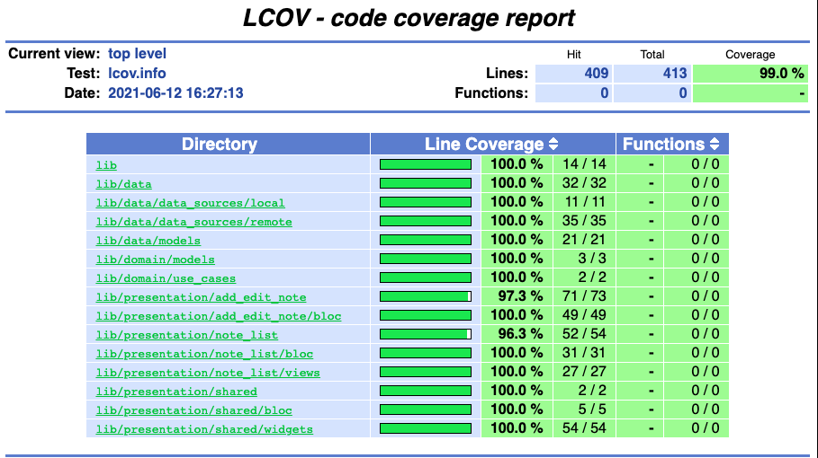

# flutter_clean_bloc

This repository contains a simple example of a Flutter project with a simple Clean Architecture with BloC pattern.

## How to run

This project is prepared to consume [this API](https://github.com/felipefpx/notes_api_ktor) locally hosted.
With the API running, it is possible to run the flutter project by running `$ flutter run`.

## Flutter Project

### Architecture Overview

### Dependencies

- [equatable](https://pub.dev/packages/equatable): A Dart package that helps to implement value based equality without needing to explicitly override == and hashCode;
- [flutter_bloc](https://pub.dev/packages/flutter_bloc): Flutter Widgets that make it easy to implement the BLoC (Business Logic Component) design pattern. Built to be used with the bloc state management package;
- [http](https://pub.dev/packages/http): A composable, multi-platform, Future-based API for HTTP requests;
- [json_annotation](https://pub.dev/packages/json_annotation): Classes and helper functions that support JSON code generation via the `json_serializable` package;
- [nuvigator](https://pub.dev/packages/nuvigator): A powerful routing abstraction over Flutter navigator, providing some new features and an easy way to define routers;
- [provider](https://pub.dev/packages/provider): A wrapper around InheritedWidget to make them easier to use and more reusable;
- [rxdart](https://pub.dev/packages/rxdart): RxDart is an implementation of the popular reactiveX api for asynchronous programming, leveraging the native Dart Streams api.

### Dev Dependencies

- [bloc_test](https://pub.dev/packages/bloc_test): A testing library which makes it easy to test blocs. Built to be used with the bloc state management package;
- [build_runner](https://pub.dev/packages/build_runner): A build system for Dart code generation and modular compilation;
- [effective_dart](https://pub.dev/packages/effective_dart): Linter rules corresponding to the guidelines in Effective Dart;
- [json_serializable](https://pub.dev/packages/json_serializable): Automatically generate code for converting to and from JSON by annotating Dart classes;
- [mocktail](https://pub.dev/packages/mocktail): A Dart mock library which simplifies mocking with null safety support and no manual mocks or code generation;

### Generate code coverage report

- **Required**: install the LCov for your operating system (ex: run `$ brew install lcov` on mac);
- Run this command to generate the html coverage: `$ flutter test --coverage && genhtml -o coverage coverage/lcov.info`

